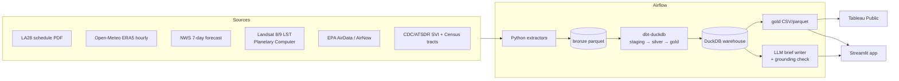

# LA28 Heat Risk

Heat-illness risk for every LA28 Olympic venue and session. The pipeline combines 11 summers of
hourly weather, Landsat surface temperature, EPA air quality and CDC community vulnerability
into one score per session. It publishes a Tableau Public dashboard and a Streamlit app that
writes plain-English heat safety briefs for each venue.

The core metric is **WBGT (Wet Bulb Globe Temperature)**, not air temperature. WBGT is the
heat-stress index that sports medicine, OSHA and the military use. It is computed here from
first principles with the Liljegren et al. (2008) energy-balance model.

> The LA28 Games run July 14–30, 2028 (early competition starts July 10). This project scores
> the official session schedule (v3.1, June 2026) against the climate of those exact calendar
> days and clock hours.

## Architecture



| Layer | Tool | Where |
|---|---|---|
| Orchestration | Apache Airflow 3.3 (separate venv, `BashOperator` → `uv run`, Asset-triggered forecast DAG) | [orchestration/dags](orchestration/dags) |
| Extraction | Python, requests, pdfplumber, pystac-client, rasterio, geopandas | [ingestion/](ingestion) |
| Physics | Vectorised Liljegren WBGT + NOAA solar position, unit-tested | [heatrisk/wbgt.py](heatrisk/wbgt.py) |
| Transform | dbt-core + dbt-duckdb (SQL and Python models, seeds, tests) | [transform/](transform) |
| Warehouse | DuckDB, one file | `data/warehouse.duckdb` |
| AI | Ollama (local) or Claude API; numeric grounding check | [ai/briefs.py](ai/briefs.py) |
| Apps | Streamlit + pydeck; Tableau Public from CSV extracts | [app/](app) |

## Data sources (five data types)

| Source | Type | What we use |
|---|---|---|
| [LA28 Competition Schedule by Session v3.1](https://la28.org/en/games-plan.html) | Unstructured PDF | 854 sessions: venue, sport, date, start/end, medal sessions |
| [Open-Meteo archive](https://open-meteo.com/en/docs/historical-weather-api) | API JSON | Hourly temperature, humidity, wind, pressure, direct/diffuse radiation, Jul 1–Aug 15, 2015–2025 |
| [NWS api.weather.gov](https://www.weather.gov/documentation/services-web-api) | API JSON | Hourly 7-day forecast per venue |
| [Landsat C2 L2 via Planetary Computer](https://planetarycomputer.microsoft.com/dataset/landsat-c2-l2) | Raster (COG) | Summer land-surface temperature at 30 m around each venue |
| [EPA AirData](https://aqs.epa.gov/aqsweb/airdata/download_files.html), [AirNow](https://docs.airnowapi.org/) | Tabular files / API | Daily max 8-h ozone AQI and PM2.5 at monitors within 25 km |
| [CDC/ATSDR SVI 2022](https://www.atsdr.cdc.gov/place-health/php/svi/), [Census tracts](https://www.census.gov/geographies/mapping-files/time-series/geo/cartographic-boundary.html) | Geospatial shapes + CSV | Vulnerability percentile, age 65+, households without a car, poverty |

## How a session gets scored

1. **Parse the schedule.** [ingestion/schedule_pdf.py](ingestion/schedule_pdf.py) rebuilds the
   PDF grid from its drawn geometry: border rectangles give the venue and sport blocks, vertical
   rules give the day columns, and cell fill colour marks gold and bronze medal sessions. Plain
   text extraction (and LLM extraction on that text) misassigns sessions, because merged cells
   centre their labels vertically. Oklahoma City sessions are printed in both OKC and LA time;
   the parser keeps the rows labelled "LA Time".
2. **Place the venues.** The schedule uses internal names ("2028 Stadium", "DTLA Arena"), so a
   seed maps each one to a real place and to `outdoor` / `covered` / `indoor`. The seed was
   compiled by an AI assistant and checked against LA28's venue pages in September 2026: all
   49 names match the official list, and the six football stadiums use the venues announced
   in February 2026. LA28 does not publish indoor/outdoor for every venue, so some exposure
   labels (and SoFi as `covered`) remain judgement calls, and the exact sites of Valley
   Complexes 2-4 are not public. The places are geocoded with OpenStreetMap Nominatim, and
   two wrong hits are fixed by documented overrides.
3. **Hourly WBGT.** For each venue grid cell and each hour of 11 summers, a dbt Python model
   runs the Liljegren model (globe and natural wet-bulb energy balance). It uses the sun
   position at mid-hour, Open-Meteo's measured direct/diffuse split, and wind adjusted from
   10 m to 2 m. That is about 500k hours in about 5 s.
4. **Analog days.** Each session is matched to the same clock hours on the same calendar date
   ±3 days in every baseline year, which gives about 77 comparable days. From these we get the
   median and p90 peak WBGT and the probability of a red or black flag.
5. **Context.** Area- and population-weighted SVI within 3 km, the Landsat LST anomaly against
   the surrounding 10 km, and the share of summer days with ozone AQI above 100.
6. **Composite score (0–100)** with transparent linear ramps and weights in
   [seeds/risk_weights.csv](transform/seeds/risk_weights.csv). Missing components are dropped
   and the remaining weights renormalised; `weight_coverage` records how much was used.

Flag thresholds follow US Army TB MED 507: green ≥ 26.7 °C, yellow ≥ 29.4, red ≥ 31.1,
black ≥ 32.2 (80/85/88/90 °F).

## Key design decisions

- **WBGT over temperature.** Humidity and sun matter as much as air temperature. The sun and
  shade WBGT columns also let covered venues (SoFi) and indoor venues be treated differently.
- **Physics in Python, orchestration in SQL.** The WBGT model is a tested library
  ([tests/test_wbgt.py](tests/test_wbgt.py)). dbt only wires columns into it, which keeps the
  physics reviewable and the lineage visible.
- **Airflow in its own environment.** Airflow pins hundreds of dependencies. Running it from a
  separate venv and calling tasks through `uv run` avoids conflicts with dbt, geopandas and
  rasterio. This is the same isolation `KubernetesPodOperator` or `ExternalPythonOperator`
  give in production.
- **Data-aware scheduling.** The forecast DAG runs daily *or* whenever the baseline build
  emits its Asset (`AssetOrTimeSchedule`).
- **Idempotent, resumable extractors.** Each extractor overwrites its bronze file. Rate-limited
  APIs cache per chunk, so a rerun resumes where it stopped.
- **The LLM writes; it doesn't compute.** Briefs are generated from a JSON fact sheet. A
  grounding check extracts every number in the output and flags any that isn't in the facts.

## Run it

```bash
# 1. environments
make setup            # uv sync: pipeline, dbt, app
make airflow-setup    # separate Airflow 3.3 venv + metadata DB
cp .env.example .env  # optional keys (AirNow, Census, Anthropic)

# 2. pipeline, either directly...
make all              # extract → dbt build → export → briefs
# ...or through Airflow
make airflow          # UI at http://localhost:8080 → trigger la28_baseline

# 3. look at it
make app              # Streamlit
make test             # pytest + dbt tests
```

Tableau Public: connect to `data/gold/gold_session_risk.csv`, `gold_venue_summary.csv` and
`venue_hourly_profile.csv`.

## Ethics and limitations

- **This is not medical or operational advice.** It is a portfolio analysis of public data.
  Real heat plans need on-site WBGT sensors and medical staff.
- **Resolution.** The reanalysis grid (about 9–25 km) doesn't resolve stadium microclimates.
  Landsat passes at about 10:30 local time, so LST describes the surface, not afternoon air.
- **Vulnerability data describes neighbourhoods, not people.** SVI marks where heat plans
  should invest in cooling centres, transit and outreach. It is not a label for residents.
- **Weights are judgement calls.** They are published, editable, and shown next to each score.
- **Schedule and venues change.** The pipeline pins schedule v3.1. Temporary venues (Sepulveda
  Basin, Long Beach waterfront) use approximate locations, noted in the venue seed.
- Out-of-region soccer venues use city-level points and aren't timed yet ("TBD" in the schedule).

## Repo layout

```
orchestration/   Airflow DAGs (baseline + forecast)
ingestion/       extractors -> data/bronze/*.parquet
heatrisk/        WBGT physics, solar geometry, gold exports
transform/       dbt project: seeds, staging -> silver -> gold, tests
ai/              LLM heat safety briefs with grounding check
app/             Streamlit app
tests/           pytest
data/            bronze / gold (bronze and warehouse gitignored)
```
